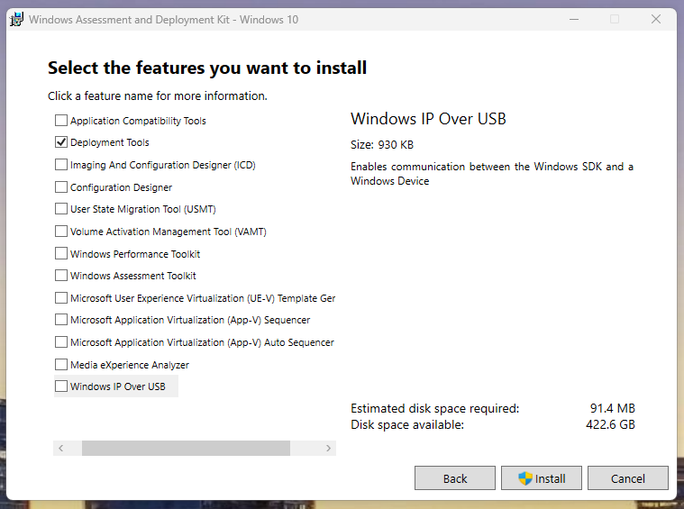
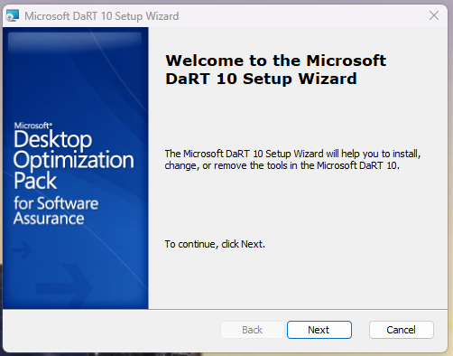

# OSDCloud Build Environment

These instructions are for installing the OSDCloud development software on your local machine. This is where you will build the ISO file that can be deployed via PXE or USB drive and will connect to the online 

## Installation
1. Install the Microsoft Deployment Toolkit on your local machine


2. Install the Windows Assessment and Deployment Toolkit on your local machine. Only check "Deployment Tools"


3. Install the Microsoft DaRT tools setup next


> Make sure to use the correct ADK installer for Windows 10 or 11

4. Install the OSDCloud module

```powershell
Set-ExecutionPolicy RemoteSigned -Force
Install-Module OSD -Force
```
# Setup Cloud Workspaces

This repository is for building the reference ISO for SBC Windows Imaging. Open VS Code/Terminal and **Run as Administrator**, this is needed for DISM to work correctly

1. ```sbcwin11-setup.ps1``` is for Production, it creates a workspace at C:\SBCWin11. The OSDCloud Template lives in C:\ProgramData\OSDCloud 

2. ```sbcwin11dev-setup.ps1``` is for Dev, it creates a workspace at C:\SBCWin11dev. The OSDCloud Template lives in C:\ProgramData\OSDCloud\Templates\dev


3. When copying out the ISO file, always use the NoPrompt version

